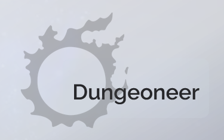

  

## About
XIV Dungeoneer is a project meant to keep track of what collectibles you are missing from dungeons, trials or raids in the game Final Fantasy XIV.
You can either store your collection locally or log in and store it on your account. If you decide to log in after using the local collection, you can always sync your collections, so no need to worry.

## Built With

  
  

  
  
## Usage
You can run the project in development mode from the main folder with **npm run dev**.

To initialize the database, run **npm run db:push**. 
Optionally, run **npm run db:seed** to seed the database. This will fetch data from *xivapi* and *ffxivcollect* and attach all collectibles to their corresponding sources.

All necessary environment variables can be found in **.env.example**.

Commit messages must follow the [Conventional Commits](https://www.conventionalcommits.org/en/v1.0.0/) specification.
